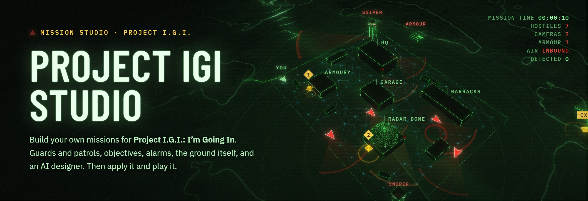

<div align="center">



<h3>Build your own missions for <i>Project I.G.I.: I'm Going In</i>.</h3>

<p>Place guards and draw their patrols on the map computer, set objectives and alarms,<br>
shape the ground, or just ask the AI designer. Then apply it and play it in the game.</p>

<a href="https://naumanhsa.github.io/project-igi-studio-site/download"></a>
<a href="https://naumanhsa.github.io/project-igi-studio-site/manual/"></a>
<a href="https://naumanhsa.github.io/project-igi-studio-site/"></a>

<br>

<a href="https://github.com/NaumanHSA/project-igi-studio/releases/latest"></a>
<a href="https://github.com/NaumanHSA/project-igi-studio/releases"></a>
<a href="https://github.com/NaumanHSA/project-igi-studio/actions/workflows/release.yml"></a>

<a href="LICENSE"></a>


<p>
<a href="#whats-new-in-10">What's new</a> ·
<a href="#whats-in-the-box">What's in the box</a> ·
<a href="#get-started">Get started</a> ·
<a href="#how-it-works">How it works</a> ·
<a href="#the-compiler">The compiler</a> ·
<a href="#building-it-yourself">Build it</a> ·
<a href="#documentation">Docs</a>
</p>

</div>

## What's new in 1.0

The first public release. The studio is now **one Windows installer** that needs
nothing else: no Python, no IGI ToolKit, no manual steps.

- **Its own compiler.** The game's mission scripts are read and written by the studio
  itself. All 884 of them round-trip byte for byte, so the third party toolkit is gone.
- **A first run that sets itself up.** It finds your game, checks the build, keeps a
  checked reference copy of the levels, and reads everything the editor needs.
- **Your game stays safe.** The 14 original missions are never written; your missions
  go into slots of their own, 15 and up.
- **Updates itself.** An installed studio fetches new versions and installs them when
  you close it. Settings, Updates turns it off.

Everything else is in the [changelog](CHANGELOG.md).

## What's in the box

<table>
<tr>
<td width="50%" valign="top">

<b>The map computer</b><br>
Design on the green map you know from the game: contours, buildings seen from above, every guard and pickup as a symbol. Zoom, drag, place.
</td>
<td width="50%" valign="top">

<b>Guards that patrol</b><br>
Soldiers, snipers and officers, their routes drawn on the walkways, how far they see and how hard they fight. Sight lines show what they cover.
</td>
</tr>
<tr>
<td valign="top">

<b>Objectives and events</b><br>
Destroy, steal, reach, rescue, survive. Chain them with triggers so doors open, reinforcements arrive and the briefing plays when you say.
</td>
<td valign="top">

<b>Cameras and alarms</b><br>
Security cameras with their sweep drawn on the map, alarm panels, sirens, and who comes running when the alarm goes off.
</td>
</tr>
<tr>
<td valign="top">

<b>Ground and buildings</b><br>
Raise, flatten and paint the terrain, place buildings, fences, towers and trees, and see it all in a 3D close-up before you play.
</td>
<td valign="top">

<b>An AI designer</b><br>
Say what you want in plain words. It reads the map, places the guards, writes the objectives, and lists every change for you to keep or undo.
</td>
</tr>
<tr>
<td valign="top">

<b>Its own compiler</b><br>
The game's QVM scripts, read and written by the studio: all 884 round-trip byte for byte. No external tools, nothing to install.
</td>
<td valign="top">

<b>Your game stays safe</b><br>
The originals are never touched. Every mission is built from a checked reference copy and written only into its own slot, so you can always go back.
</td>
</tr>
</table>

## A look inside

<table>
<tr>
<td width="50%"></td>
<td width="50%"></td>
</tr>
<tr>
<td align="center"><sub><b>The map computer.</b> The whole mission on one map: guards and their sight, patrols, objectives, cameras.</sub></td>
<td align="center"><sub><b>The 3D close-up.</b> The same place with the real buildings and ground, to check a sniper's line.</sub></td>
</tr>
<tr>
<td></td>
<td></td>
</tr>
<tr>
<td align="center"><sub><b>The AI designer.</b> Every change it makes is listed, shown on the map, and yours to keep or undo.</sub></td>
<td align="center"><sub><b>The mission library.</b> The originals to learn from and copy, and your own, each with its slot.</sub></td>
</tr>
</table>

## Get started

1. **[Download the installer](https://naumanhsa.github.io/project-igi-studio-site/download)** and run it. It installs for
   your account only, no administrator needed. Windows may warn that it does not know the publisher,
   as the installer is not signed yet: choose **More info**, then **Run anyway**.
2. **[Connect your game.](https://naumanhsa.github.io/project-igi-studio-site/manual/first-run)** The studio finds your copy of
   Project I.G.I., checks it and prepares the levels. A few minutes, once.
3. **[Build your first mission.](https://naumanhsa.github.io/project-igi-studio-site/manual/first-mission)** Copy one of the
   originals or start from a blank map, place your guards, press **Apply**, and play it.

**You need** Windows 10 or 11 (64-bit), your own installed copy of *Project I.G.I.: I'm Going In*, and about 650 MB
of disk space, plus 300 MB in the game's folder for each mission you put in. An OpenAI key is optional, for the AI
designer only.

## How it works


- **Nothing of the game is shipped.** The studio reads your own copy, keeps a checked reference copy of what a
  mission is built from, and builds everything the editor draws on your machine.
- **Missions are compiled by the studio itself.** `studio/qvm` reads and writes the game's QVM script format,
  tested byte for byte against every script the game ships.
- **One gate for every write.** `studio/protect.py` refuses any write that is not one of your own mission slots,
  so the built-in missions and the reference copy cannot be damaged.
- **Nothing leaves your PC** unless you use the AI designer, or the studio asks GitHub for a new version. There is
  no telemetry. The [code signing policy](https://naumanhsa.github.io/project-igi-studio-site/signing) says exactly
  what goes where.

## The compiler

The game keeps every mission as compiled bytecode, `LOOP 8.5`, and for twenty-five years the only way to read
one was the IGI ToolKit. The studio reads and writes the format itself, in [`studio/qvm`](studio/qvm), so there
is nothing to install.

It is held to the game's own files rather than to itself. The ToolKit's output was captured for every script
the game ships, and then the ToolKit was retired. The reader must reproduce its decompilation byte for byte,
and the writer must turn that back into the game's original file, byte for byte:

```
python -m studio check
read   884 of 884 identical
write  884 of 884 identical
```

[docs/qvm.md](docs/qvm.md) has the format itself: the header, the 49 opcodes, the calling convention, how `if`
and `while` are built out of jumps, and what reproducing the original bytes turns out to require.

## Building it yourself

You need Windows, Python 3.12 or newer (releases use 3.14), Node 22 and your own copy of the game. Python needs
nothing beyond its standard library.

```
git clone https://github.com/NaumanHSA/project-igi-studio
cd project-igi-studio

python -m studio            the studio in your browser, at http://localhost:8765
python -m studio --help     everything else it can do from a terminal

cd app
npm install
npm start                   the desktop window, around this checkout
npm run dist                the installer and the portable zip, in app/dist
```

`npm run dist` bundles the server with PyInstaller in a virtual environment of its own, so nothing is installed
into your Python. Releases are built the same way by
[GitHub Actions](.github/workflows/release.yml) from a tag: see [docs/releasing.md](docs/releasing.md).

| Folder | What is in it |
|---|---|
| [`editor/`](editor) | The editor: one page, plain JavaScript and Canvas, three.js for the 3D close-up. No build step |
| [`studio/`](studio) | The Python package behind it: the QVM compiler, the mission builder, the readers of the game's files, the local server |
| [`app/`](app) | The desktop app: the Electron window, the bundled server, the installer, updates |
| [`docs/`](docs) | How it all works, and the plans behind it |

## Documentation

| If you want to | Read |
|---|---|
| Use the studio | [The manual](https://naumanhsa.github.io/project-igi-studio-site/manual/) |
| Know what each part of the editor does, and what it builds into the game | [docs/editor.md](docs/editor.md) |
| See how the studio is put together: the app, first run, where things are kept | [docs/architecture.md](docs/architecture.md) |
| Read the QVM script format: the opcodes, the calling convention, how it is tested | [docs/qvm.md](docs/qvm.md) |
| Learn the engine's unwritten rules and the graph file format | [docs/engine.md](docs/engine.md) |
| Cut a release | [docs/releasing.md](docs/releasing.md) |

## Contributing

Bug reports, missions that break, and pull requests are all welcome. [CONTRIBUTING.md](CONTRIBUTING.md) has the few
rules this project does not bend (the original install is never written, and no game files go in the repository),
and how to run the compiler's tests. Found a problem? [Open an issue](https://github.com/NaumanHSA/project-igi-studio/issues)
with the log from **Help, Open the log folder**.

Everyone taking part follows the [code of conduct](CODE_OF_CONDUCT.md), and security problems are reported
privately, as [SECURITY.md](SECURITY.md) says.

If the studio gave you a mission worth playing, a star helps other players find it.

## Credits

- The QVM reader and writer are ported from the C++ parsers of
  [project-igi-editor](https://github.com/HeavenHM/project-igi-editor) by HeavenHM (MIT), and tested against the game.
- [three.js](https://threejs.org) draws the 3D close-up, [Electron](https://www.electronjs.org) is the window,
  and [PyInstaller](https://pyinstaller.org) bundles the server.
- Barlow Condensed, IBM Plex Sans and IBM Plex Mono, under the SIL Open Font License.

[THIRD-PARTY-NOTICES.md](THIRD-PARTY-NOTICES.md) has the details.

## Made by

<table>
<tr>
<td><a href="https://github.com/NaumanHSA"></a></td>
<td>
<b>Nouman Ahsan</b> · <a href="https://github.com/NaumanHSA">@NaumanHSA</a> · <a href="https://nomihsa965.me">nomihsa965.me</a><br>
The map computer, the compiler, the AI designer, the installer and the site: one person, the long way.
By day, an AI engineer building agentic and generative AI systems.
</td>
</tr>
</table>

## Licence

[MIT](LICENSE). Project IGI Studio is an unofficial fan tool. *Project I.G.I.* is a trademark of its owners, and this
project is not affiliated with them. The studio ships no game files and works only with a copy of the game you own.
